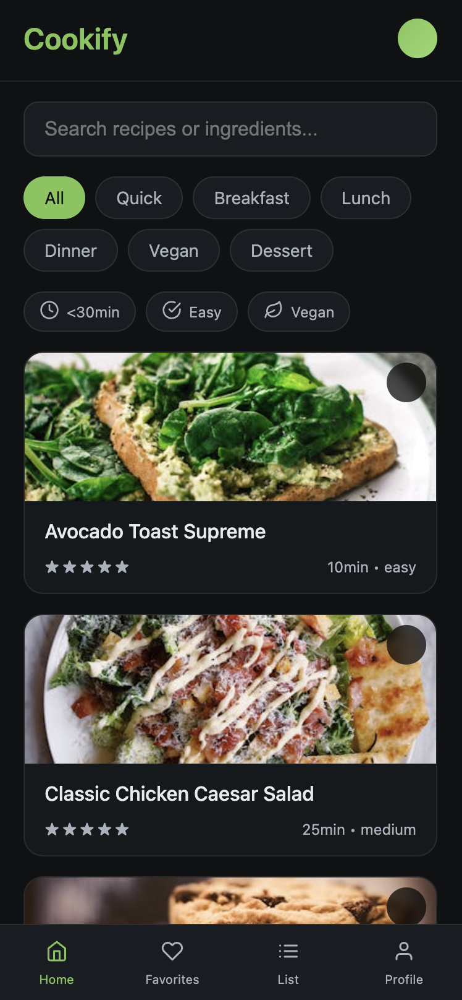
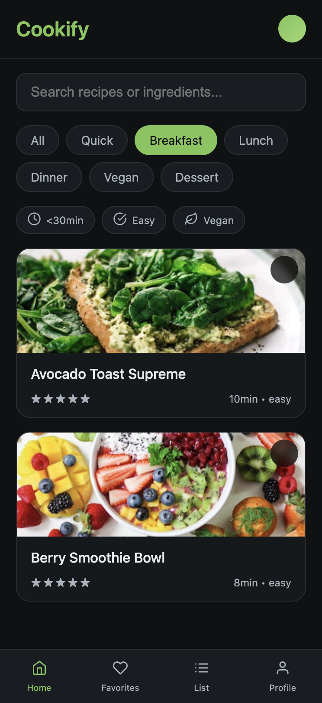
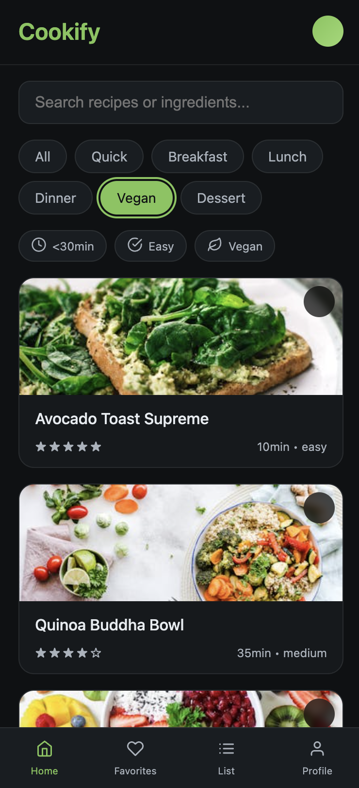
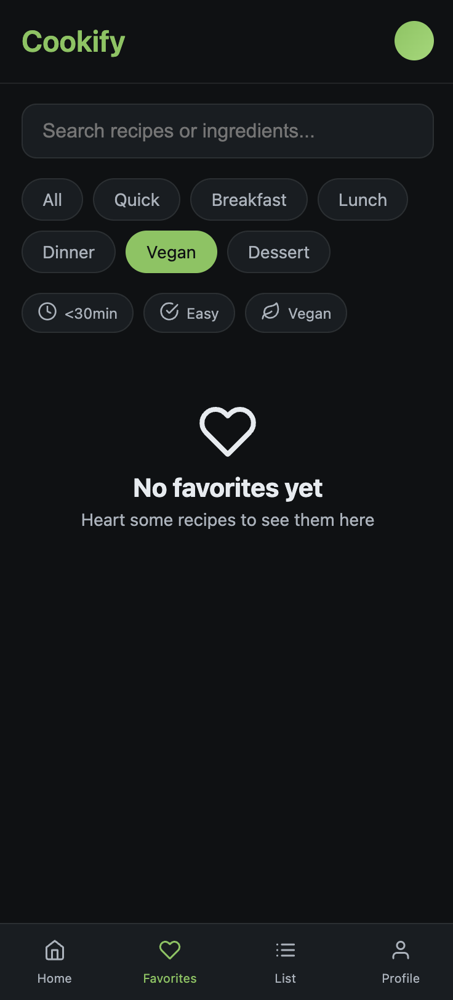
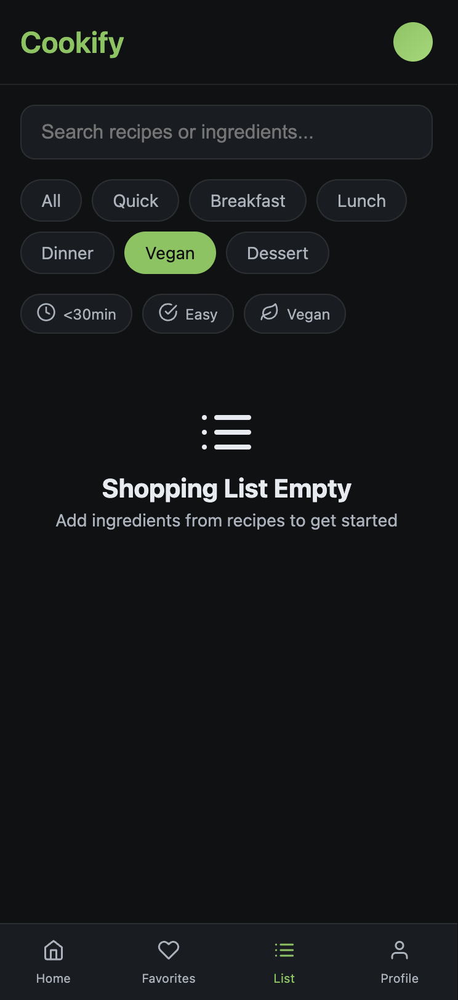
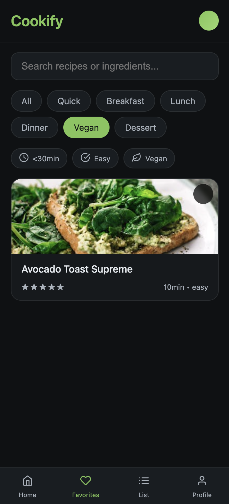
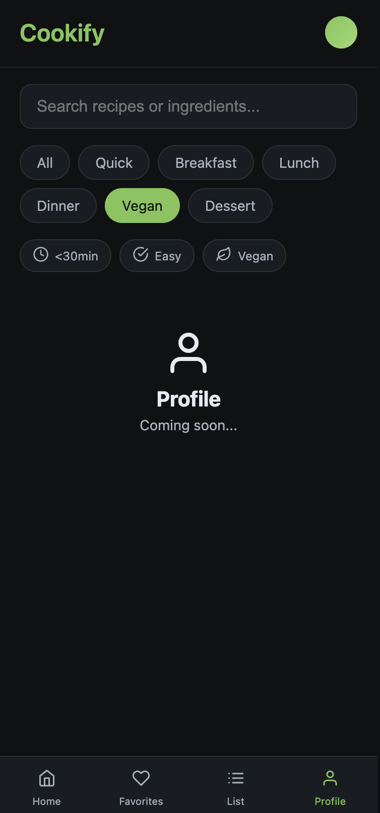

# 🍳 Cookify Recipe App

A modern, responsive recipe management application built with vanilla JavaScript and Vite. Cookify helps you discover, save, and organize your favorite recipes with an intuitive user interface.

## ✨ Features

- **Recipe Discovery**: Browse through a curated collection of delicious recipes
- **Search & Filter**: Find recipes by ingredients, cuisine type, or cooking time
- **Responsive Design**: Works seamlessly on desktop, tablet, and mobile devices
- **Modern UI**: Clean and intuitive interface with smooth animations
- **Fast Performance**: Built with Vite for lightning-fast development and build times

## 🚀 Getting Started

### Prerequisites

- Node.js (version 14 or higher)
- npm or yarn package manager

### Installation

1. Clone the repository
```bash
git clone https://github.com/mutlukurt/cookify-recipe-app.git
cd cookify-recipe-app
```

2. Install dependencies
```bash
npm install
```

3. Start the development server
```bash
npm run dev
```

4. Open your browser and navigate to `http://localhost:5173`

## 📱 Screenshots

<div style="display: grid; grid-template-columns: repeat(3, 1fr); gap: 20px; margin: 20px 0;">
  
  
  
  
  
  
  
</div>

## 🛠️ Tech Stack

- **Frontend**: Vanilla JavaScript, HTML5, CSS3
- **Build Tool**: Vite
- **Icons**: Lucide React Icons
- **Styling**: Custom CSS with modern design principles

## 📁 Project Structure

```
cookify-recipe-app/
├── assets/          # Screenshots and images
├── public/          # Static assets
├── app.js          # Main application logic
├── data.js         # Recipe data and API functions
├── icons.js        # Icon definitions
├── main.js         # Entry point
├── style.css       # Main stylesheet
├── styles.css      # Additional styles
└── index.html      # HTML template
```

## 🎯 Key Features Explained

### Recipe Management
- Browse recipes by category
- Search functionality with real-time filtering
- Detailed recipe view with ingredients and instructions

### User Experience
- Responsive design that adapts to all screen sizes
- Smooth transitions and animations
- Intuitive navigation and user interface

### Performance
- Optimized with Vite for fast development and production builds
- Efficient data loading and rendering
- Minimal bundle size for quick page loads

## 🤝 Contributing

1. Fork the repository
2. Create your feature branch (`git checkout -b feature/AmazingFeature`)
3. Commit your changes (`git commit -m 'Add some AmazingFeature'`)
4. Push to the branch (`git push origin feature/AmazingFeature`)
5. Open a Pull Request

## 📄 License

This project is licensed under the MIT License - see the [LICENSE](LICENSE) file for details.

## 👨‍💻 Author

**Mutlu Kurt**
- GitHub: [@mutlukurt](https://github.com/mutlukurt)
- Email: mutlukurta@gmail.com

## 🙏 Acknowledgments

- Recipe data and inspiration from various cooking resources
- Icons provided by Lucide React
- Built with love for the cooking community

---

⭐ If you find this project helpful, please give it a star on GitHub!
